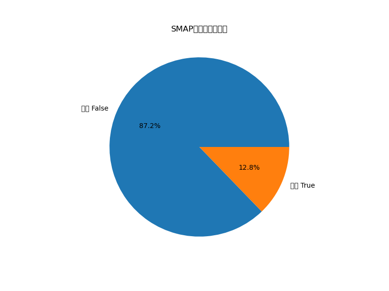
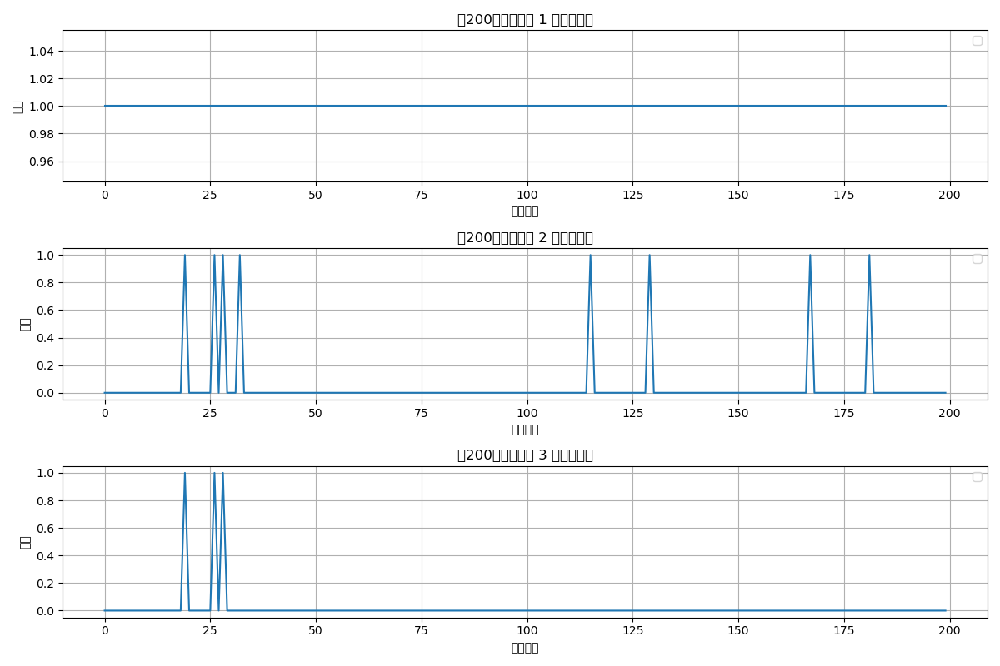

# SMAP数据集分析报告

## 1. 数据集基本信息
- **数据格式**: .npy (NumPy数组)
- **训练集大小**: (135183, 25)
- **测试集大小**: (427617, 25)
- **测试标签大小**: (427617,)
- **数据维度**: 2维

## 2. 数据分布特征
### 2.1 标签分布
- 标签 False: 372921 个样本 (87.21%)
- 标签 True: 54696 个样本 (12.79%)

### 2.2 数据统计特征
训练数据部分样本的统计特征如下：

## 3. 数据可视化
### 3.1 标签分布图

### 3.2 时间序列示例
下图展示了测试数据中部分样本的时间序列特征，红色点标记为异常点：

## 4. 数据特点总结
- 数据集为典型的异常检测数据集，异常样本数量较少（不平衡数据）
- 数据可能已经过标准化处理
- 数据为多维时间序列数据，适合用于异常检测任务
- 测试集包含标签信息，可用于评估模型性能

## 5. 后续实验建议
1. 数据预处理：根据统计特征考虑是否需要标准化或归一化
2. 模型选择：适合使用时间序列异常检测算法
3. 评估指标：建议使用精确率、召回率、F1分数等指标评估模型性能
